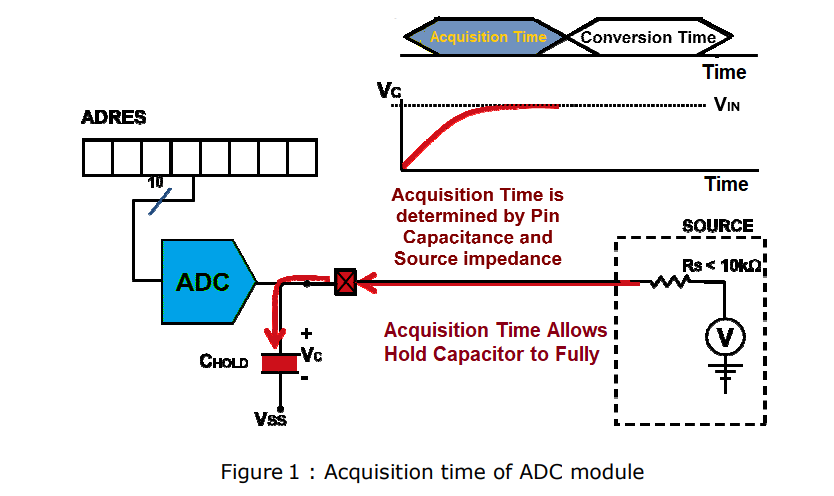
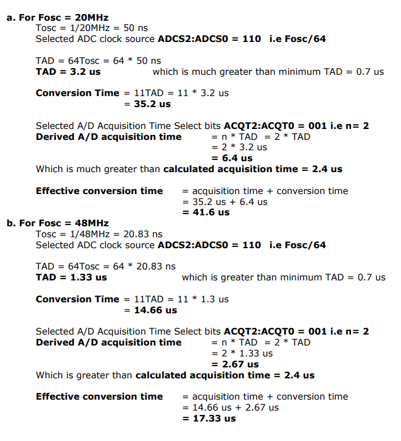
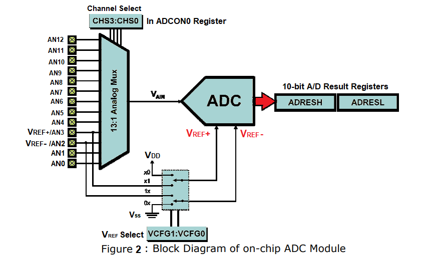

## Theory :

#### 1. ADC Devices : 
 Analog to digital converters are among the most widely used devices for data acquisitions. Digital computers use binary (discrete) value but in physical world everything is analog (continuous). A physical quantity is converted to electrical signals using device called transducer or also called as sensors. Sensors and many other natural quantities produce an output that is voltage (or current). Therefore we need an analog - to - digital converter to translate the analog signal to digital numbers so that the microcontroller can read and process them. The ADC chips are either parallel or serial. In parallel ADC, we have 8 or more pins dedicated to bring out the binary data, but in serial ADC we have only one pin for data out. 
Some of the major characteristics of ADC are :
a) resolution 
b) conversion time 
c) reference voltage (Vref).       

##### 1.1 Resolution 
 An ADC has an n bit resolution where n can be 8, 10, 16, 0r even 24 bits. The higher resolution ADC provides a smaller step size, where step size is smallest change that can be discerned by an ADC. This is shown in below Table Although the resolution for ADC chip is designed at the time of its design and cannot be changed, we can control the step size with the help of reference voltage (Vref). 

|n - bit| Number of steps|Step Size (mV)|
|------:|:--------|:--------|
|8 |256 |5/256 = 19.53|
|10| 1024|5/1024 = 4.88|
|12 |4096| 5/4096 = 1.2|
|16| 65536 |5/65536 = 0.076|

##### 1.2 Conversion time 
 Conversion time is defined as the time it takes the ADC to convert the analog input to digital (binary) number. The conversion time is dictated by the clock source connected to the ADC in addition to the method used for data conversion and technology used in the fabrication of the ADC chip. 
 In addition to conversion time, acquisition time is another major factor in judging an ADC. Acquisition time is defined as the time it takes to sample the analog voltage using sample and hold circuit. Sampled analog input is applied to actual conversion unit of ADC. In some of the ADCs, conversion time doesn’t contain the acquisition time but specified separately. Therefore effective conversion time is addition of specified conversion time and specified acquisition time. 

##### 1.3 Reference Voltage (Vref) 
 Vref is an input voltae used for the reference voltage. The voltage connected to this pin, along with resolution of the ADC chip, gives us the step size. 
step size = Vref / 2n   where n= no. of bits 
For example,
If the analog input range needs to be 0 to 3 Volts, Vref is connected to 3 Volts. That gives, 3V/1024 = 2.92 mV step size for 10-bit ADC.

|Vref (V) |Vin (V) |Step Size (mV)|
|------:|:--------:|:--------|
|5.00 |0 to 5 |5/1024 = 4.88|
|2.56 |0 to 2.56 |2.56/1024 = 2.5|
|1.024 |0 to 1.024 |1.024/1024 = 1|

#### 2. 10-Bit Analog-To-Digital Converter (A/D) Module of PIC uC 
The Analog-to-Digital (A/D) converter module has 10 inputs for the 28-pin devices and 13 for the 40/44-pin devices. This module allows conversion of an analog input signal to a corresponding 10-bit digital number.

##### 2.2 Pin Description:

|Signal |Pin No. |Symbol|
|------|:--------:|:--------|
|Channel 0 (AN0)| 2 | RA0/AN0|
|Channel 1 (AN1)| 3 | RA1/AN1 |
|Channel 2 (AN2)| 4 |RA2/AN2/Vref-/CVref|
|Channel 3 (AN3)| 5 |RA3/AN3/Vref+|
|Channel 4 (AN4)| 7 |RA5/AN4/SS/HLVDIN/C2OUT|
|Channel 5 (AN5)| 8 |RE0/AN5/CK1SPP|
|Channel 6 (AN6)| 9 |RE1/AN6/CK2SPP|
|Channel 7 (AN7)| 10| RE2/AN7/OESPP|
|Channel 8 (AN8)| 35| RB2/AN8/INT2/VMO|
|Channel 9 (AN9)| 36|RB3/AN9/VPO|
|Channel 10 (AN10)| 34| RB1/AN10/INT1/SCK/SCL|
|Channel 11 (AN11)|37| RB4/AN11/KBIO/CSSPP|
|Channel 12 (AN12)| 33| RB0/AN12/INT0/FLT0/SDI/SDA|

##### 2.3 ADC Register Map: 

|SFR |Description |Access |Reset Value |Address|
|----:|:--------|:--------|:---------:|:----------|
|ADCON0| A/D Control Register 0 | Read/Write | 0x00 | 0xFC2 |
|ADCON1 | A/D Control Register 1 | Read/Write | 0x00 | 0xFC1 | 
|ADCON2 | A/D Control Register 2 | Read/Write | 0x00 | 0xFC0 |
|ADRESH | A/D Result High Register | Read | unknown | 0xFC4 |
|ADRESL | A/D Result Low Register | Read | unknown | 0xFC3 |

##### 2.4 ADC Register Description 

##### 2.4.1 A/D Control Register 0 (ADCON0) 

|U-0|U-0|R/W-0|R/W-0|R/W-0|R/W-0|R/W-0|R/W-0|
|------|:--------|:--------|:----------:|:---------:| ----:|:---------:|:------|
|-|-|CHS3|CHS2|CHS1|CHS0|GO/DONE|ADON|
|bit 7|||||||bit 0|

**ADCON0 Register in our Program**
bit7-6 This two bits are Unimplemented so we write this bit as 00 
bit5-2 Analog input is connected to Channel 1 (AN1). so we have to write CHS3:CHS0 analog channal select bits as 0001
bit1 Start Conversion by setting this bit. Later on poll the same conversion status. 
Bit0 To turn ON ADC set this bit 1.

##### 2.4.2 A/D Control Register 1 (ADCON1) 

**ADCON1 Register in our Program**
- Bit7-6 This two bits are Unimplemented so we write this bit as 00 
- Bit 5 In our application (VREF-) supply as 0 volt so we write this bit as 0. 
- Bit 4 In our application (VREF+) supply as 5 volt so we write this bit as 0. 
- Bit3-0 Here we are using only one analog channal AN1. Therefor we write this bit as PCFG3:PCFG0 - 1101.

##### 2.4.3 A/D Control Register 2 (ADCON2) 

|R/W-0|U-0|R/W-0|R/W-0|R/W-0|R/W-0|R/W-0|R/W-0|
|------|:--------|:--------|:----------:|:---------:| ----:|:---------:|:------|
|ADFM|-|ACQT2|ACQT1|ACQT0|ADCS2|ADCS1|ADCS0|
|bit 7|||||||bit 0|

###### **2.4.3.1 A/D Result Format Select bit (ADFM):** 
 We need right justified data. Therefore ADFM = ‘1’.
If you write 1 then result is right justified as shown below; 

If you write 0 then result is left justified as shown below;

###### **2.4.3.2 A/D Conversion Clock Select bits (ADCS2:ADCS0)**
 The A/D conversion time per bit is defined as TAD. The A/D conversion requires 11 TAD per 10-bit conversion. The source of the A/D conversion clock is software selectable. There are seven possible options for TAD as shown in table For correct A/D conversions, the A/D conversion clock (TAD) must be as short as possible but greater than the minimum TAD. Table shows the resultant TAD times derived from the device operating frequencies and the A/D clock source selected. 
**Minimum TAD = 0.7 us** (to be maintained as per datasheet) 
Therefore for 10bit ADC 
Typical conversion time = 11 TAD = 11 * 0.7 us = 7.7 us

###### **2.4.3.3 A/D Acquisition Time Select bits**
Figure 1 shows the acquisition time (TACQ) is depends on amplifier settling time, capacitor charging time and temperature coefficient. 
TACQ = TAMP + TC + TCOFF  
Where,  
TAMP : Amplifier Settling Time = 0.2 us (Typical value)  
TC : Holding Capacitor Chargi  
	= -(CHOLD)(RIC + RSS + RS) ln(1/2048) µs   
	= -(25 pF) (1 kΩ + 2 kΩ + 2.5 kΩ) ln(0.0004883) µs (Typical value)  
	= 1.05 µs   
TCOFF : Temperature Coefficient = (Temp – 25°C)(0.02 µs/°C)   
								= (85°C – 25°C)(0.02 µs/°C) (Typical temp)  
								= 1.2 µs   

Therefore minimum calculated acquisition time is  
**TACQ = 0.2 µs + 1.05 µs + 1.2 µs = 2.45 µs**
Derived A/D acquisition time ≥ Calculated acquisition time TACQ Derived A/D acquisition time = n x TAD where n is depends on A/D Acquisition Time Select bits (ACQT2:ACQT0). So select A/D Acquisition Time Select bits (ACQT2:ACQT0) such that the we meet above timings. 

#### 2.5 Calculations 

 

#### 2.6 ADC operation 

The following steps should be followed to perform an A/D conversion :
1. Configure the A/D module:
   -  Configure analog pins, voltage reference and digital I/O (ADCON1)
   -  Select A/D input channel (ADCON0)
   -  Select A/D acquisition time (ADCON2)
   -  Select A/D conversion clock (ADCON2)
   -  Turn on A/D module (ADCON0)
2. Configure A/D interrupt (if desired):
   -  Clear ADIF bit 
   -  Set ADIE bit 
   -  Set GIE bit 
3. Wait the required acquisition time (if required).
4. Start conversion: 
   -  Set GO/DONE bit (ADCON0 register)
5. Wait for A/D conversion to complete, by either:
   -  Polling for the GO/DONE bit to be cleared
	OR 
   -  Waiting for the A/D interrupt
6. Read A/D Result registers (ADRESH:ADRESL);
7. For next conversion, go to step 1 or step 2, as per bit is defined as TAD. A minimum wait of 3 TAD is acquisition starts. 

